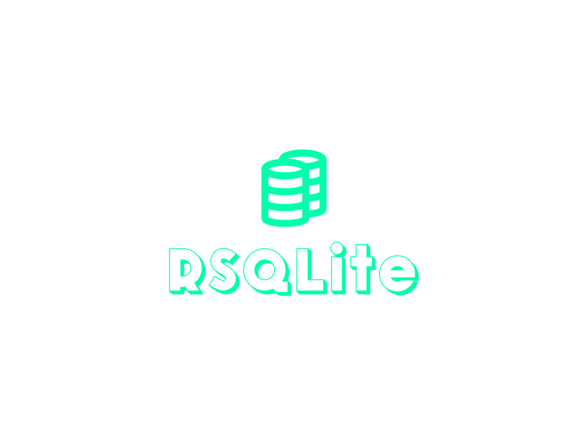

simple sqlite clone rust

https://www.sqlite.org/lang_select.html
https://www.sqlite.org/lang_insert.html

////////////////////////////////////////// database page
page size                  2 bytes
locked                     1 bytes
File change counter        4 bytes
database pages             4 bytes
page size                  2 bytes
// btree data later

/////////////////////////////////////////// tables page
16 bytes of metadata
bytes 0 // 0 for database page 
        // 1 for tables page
bytes 1
bytes 2
bytes 3
bytes 4
bytes 5
bytes 6
bytes 7
bytes 8
bytes 9
bytes 10
bytes 11
bytes 12
bytes 13
bytes 14
bytes 15

page is tables page                 1 byte // 1
table id                            4 byte

/////////////////////////////////////////// data pages
page is tables page                 1 bytes // 0
table it belongs to                 4 bytes

## features
- [] terminal navigation (rustyline)
- [] tokenizer
- [] parser
- [] data pagination
- []
- []
- []
- []
- []
- []
- []
- []
- []